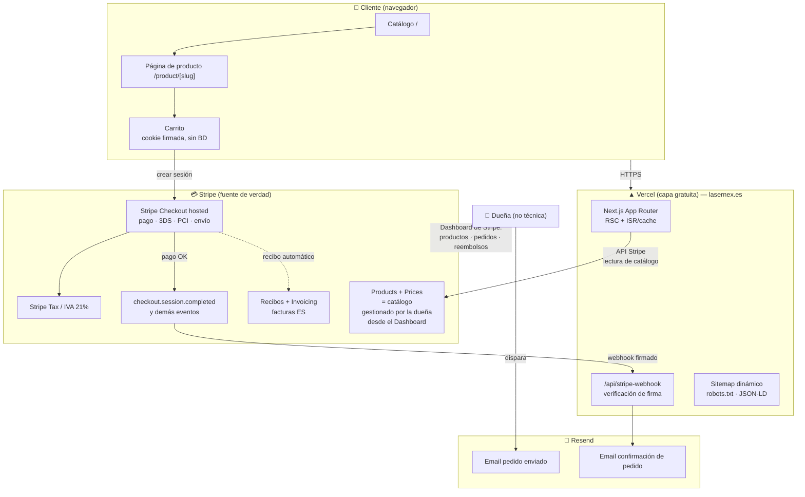

# ARCHITECTURE.md — Lasernex

> Tienda online de piezas impresas en 3D · lasernex.es
> Stack: Next.js (App Router, TypeScript estricto, Tailwind) + Stripe + Resend + Vercel
> Principio rector: **cero infraestructura propia**. Sin base de datos, sin servidor, sin autenticación de usuarios. Stripe es la única fuente de verdad.

---

## 1. Diagrama de arquitectura

---

## 2. Flujo de compra paso a paso

1. **Catálogo (`/`)** — El servidor (RSC) lee `Products` + `Prices` activos de la API de Stripe. Se cachea (ISR) para no golpear la API en cada visita; revalidación periódica o bajo demanda.
2. **Página de producto (`/product/[slug]`)** — Datos del producto desde Stripe (nombre, descripción, imágenes, precio, variantes via metadata). Incluye JSON-LD `schema.org/Product` y Open Graph.
3. **Carrito** — Estado en cookie firmada (líneas: `price_id` + cantidad). **No hay BD**: el carrito vive en el navegador del cliente.
4. **Checkout** — Botón "Pagar" crea una `Checkout Session` (server action / route handler) con: líneas del carrito, `shipping_address_collection` limitado a `ES`, `shipping_options` (tarifas de envío), IVA, y `locale: 'es'`. Redirección a la **página hosted de Stripe** (pago, 3D Secure, PCI: todo lo cubre Stripe).
5. **Pago completado** — Stripe emite `checkout.session.completed` → nuestro endpoint `/api/stripe-webhook` **verifica la firma** con `STRIPE_WEBHOOK_SECRET`.
6. **Email de confirmación** — El webhook dispara un email transaccional de marca vía **Resend** (plantilla React Email en español con resumen del pedido).
7. **Recibo y factura** — Stripe envía su recibo automático; con **Stripe Invoicing** se emite factura con NIF/CIF y numeración correcta cuando el cliente la necesita.
8. **Gestión del pedido** — La dueña ve el pedido en el Dashboard de Stripe, prepara el paquete y, al enviarlo, dispara el email de "pedido enviado" (Fase 3: mecanismo simple, sin panel propio).
9. **Vuelta a la tienda** — Stripe redirige a `/pedido/confirmado?session_id=...` (página de gracias, sin datos sensibles en URL más allá del id de sesión).

**Reembolsos y desistimiento (14 días)**: la dueña lo hace desde el Dashboard de Stripe (botón "Reembolsar"). Stripe notifica al cliente. Sin código propio.

---

## 3. Qué vive en Stripe vs qué vive en el código

| Responsabilidad | Stripe | Código (Next.js en Vercel) |
|---|---|---|
| Catálogo (productos, precios, fotos, variantes) | ✅ Products/Prices + metadata | Solo lectura y render |
| Carrito | — | ✅ Cookie firmada en el cliente |
| Pago, 3DS, PCI-DSS | ✅ Checkout hosted | Solo crea la sesión |
| Impuestos (IVA 21%) | ✅ Stripe Tax o precios IVA incluido | Configuración |
| Envíos (zonas y tarifas España) | ✅ Shipping rates en Checkout | Configuración |
| Pedidos (listado, estado, búsqueda) | ✅ Dashboard | — |
| Reembolsos / devoluciones | ✅ Dashboard | — |
| Recibos y facturas | ✅ Recibos automáticos + Invoicing | — |
| Emails de marca (confirmación, enviado) | — | ✅ Webhook → Resend |
| SEO, sitemap, JSON-LD, OG | — | ✅ Next.js |
| Páginas legales, contenido, marca | — | ✅ Páginas estáticas |
| Antifraude | ✅ Stripe Radar (incluido) | — |
| HTTPS, CDN, deploy | Vercel ✅ | Configuración |

**Regla de oro**: si un dato puede vivir en Stripe, vive en Stripe. El código nunca es fuente de verdad de nada comercial.

---

## 4. ADRs (Architecture Decision Records)

### ADR-001 — Sin base de datos propia
- **Decisión**: no hay BD. Catálogo y pedidos viven en Stripe; el carrito, en una cookie.
- **Por qué**: coste 0 €/mes real (una BD gestionada gratis siempre acaba teniendo límites o coste), cero mantenimiento, cero backups, cero migraciones, y una única fuente de verdad que la dueña ya usa (Dashboard de Stripe). Con <100 pedidos/mes no existe ningún requisito que Stripe no cubra.
- **Contrapartida**: consultas complejas de catálogo (filtros avanzados, búsqueda full-text) están limitadas; con un catálogo pequeño es irrelevante. Si en Fase 2+ hiciera falta, se añade caché/índice sin cambiar la fuente de verdad.

### ADR-002 — Checkout con Stripe Elements embebido (PaymentIntent) — ⚠️ CORREGIDO en Fase 1
- **Decisión original (Fase 0)**: se asumió Stripe Checkout hosted (redirección a `checkout.stripe.com`).
- **Corrección (verificada en Fase 1 probando el flujo real de principio a fin)**: el código de `a98a19f` **no usa Checkout Sessions hosted**. Usa **Stripe Elements embebido** (`@stripe/react-stripe-js`, `stripe-elements-container.tsx`, `stripe-payment.tsx`) sobre un **PaymentIntent** creado y actualizado por `commerce-kit` (`cartCreate`/`updatePaymentIntent`), con un formulario propio en `/cart` para dirección y método de envío, y los campos de tarjeta de Stripe Elements montados ahí mismo (no hay redirección a un dominio de Stripe).
- **Por qué se mantiene así (no se revierte a hosted)**: cambiar a Checkout Sessions hosted sería reescribir la capa de carrito/checkout de `commerce-kit`, un cambio grande fuera de alcance de "traer y actualizar deps". Elements sigue delegando la introducción de datos de tarjeta a iframes de Stripe (Stripe.js) — **la tarjeta nunca toca nuestro servidor ni nuestro JS**, manteniendo un alcance PCI reducido (SAQ A-EP en vez de SAQ-A) y 3D Secure/SCA gestionado por Stripe (`automatic_payment_methods`).
- **Efecto en el resto de documentos**: `SECURITY.md` §2 sigue aplicando igual (el webhook verifica `payment_intent.succeeded`, ya lo hacía el código base). `ACCESSIBILITY.md` necesita cubrir el formulario propio de checkout (dirección + envío), no solo el carrito — se añade a la checklist de Fase 2/3. Ningún ADR de "sin BD"/"sin auth" se ve afectado.
- **Verificado en Fase 1**: catálogo → producto → carrito → selección de método de envío (tarifa de España creada de prueba) funcionando de principio a fin en local con claves de test reales.

### ADR-003 — Checkout como invitado (sin cuentas de usuario)
- **Decisión**: no hay registro ni login de clientes.
- **Por qué**: para <100 pedidos/mes las cuentas no aportan valor y sí coste: gestión de contraseñas, recuperación, más superficie GDPR (derecho de acceso/supresión sobre cuentas), más fricción de compra. El cliente recibe todo por email; el historial vive en Stripe.
- **Contrapartida**: sin área "mis pedidos". Si algún día se necesita, Stripe soporta customer portal / links de recibo sin construir auth propia.

### ADR-004 — Base de partida: fork de YNS "pure-Stripe" ✅ DECIDIDO (opción A, 2026-07-11)
- **Contexto (verificado el 2026-07-11 contra el repo real)**: `yournextstore/yournextstore` **pivotó a finales de 2025**. El `main` actual (Next 16 canary, Bun, commerce-kit 0.53) **ya no usa Stripe como catálogo**: requiere `YNS_API_KEY` y los productos se gestionan en la plataforma SaaS `yns.store` (su admin propio, con auth y editor). Eso rompe tres requisitos del proyecto: dueña gestionando desde el **Dashboard de Stripe**, **0 €/mes** y sin dependencia de terceros adicionales.
- **Opciones**:
  - **A (recomendada)**: partir del último commit "pure-Stripe" (`a98a19f`, ene-2025: Next 15, `stripe@17`, `STRIPE_SECRET_KEY`, catálogo directo de Stripe) y actualizar nosotros a Next 16 estable + deps al día. Se mantiene el stack cerrado tal cual.
  - **B**: usar el `main` actual y aceptar la plataforma YNS (contradice el stack cerrado; pricing/lock-in fuera de nuestro control).
  - **C**: usar el `main` actual solo como referencia de UI y reescribir la capa de datos contra Stripe (más trabajo que A, beneficio dudoso).
- **Estado**: **Álvaro confirmó la opción A** (2026-07-11). En Fase 1: traer el código de `a98a19f` a este repo privado (un fork de GitHub no puede ser privado) y actualizar a Next 16 estable + dependencias al día.

### ADR-005 — Emails transaccionales con Resend (no solo los de Stripe)
- **Decisión**: Stripe envía recibos/facturas; los emails de marca (confirmación con diseño propio, "pedido enviado") van por Resend.
- **Por qué**: capa gratuita (3.000 emails/mes ≫ volumen esperado), plantillas React Email versionadas en el repo, dominio propio verificado (SPF/DKIM) para entregabilidad y confianza.

### ADR-006 — `commerce-kit` fijado en `0.0.39` (no actualizar) ⚠️ HALLAZGO DE FASE 1
- **Contexto (verificado 2026-07-11 inspeccionando los tarballs de npm de commerce-kit desde 0.0.39 hasta 0.53.0)**: el paquete `commerce-kit` —la capa que traduce el catálogo de Stripe a la tienda— sufrió el MISMO pivote que motivó el ADR-004. La versión `0.0.39` (la de nuestro commit base) es la última que habla directo con Stripe (`STRIPE_SECRET_KEY`, `new Stripe(...)`). A partir de `~0.10.0` el paquete empieza a depender de la plataforma SaaS de YNS (mismo patrón `YNS_API_KEY`/`yns.store`); las versiones intermedias (`0.1.0`–`0.9.x`) ya estaban en transición.
- **Decisión**: NO actualizar `commerce-kit` más allá de `0.0.39` bajo ningún concepto, aunque `bun outdated` lo marque como muy desactualizado. Si algún día hace falta una función nueva de una versión posterior, evaluar caso a caso si esa versión concreta sigue funcionando sin `YNS_API_KEY` (repetir la inspección de tarballs) antes de tocarlo.
- **Efecto colateral**: esto fija también `typescript` (`5.9.3`) y `@types/node` (`22.20.1`) por debajo de sus últimas versiones (`7.x`/`26.x`), ya que son `peerDependencies` declaradas por `commerce-kit@0.0.39` (`^5.5.4`, `^20||^22`). Actualizar TS/node más allá de eso rompe la instalación (`npm error ERESOLVE`).

### ADR-007 — Licencia del código base: AGPL-3.0 / Comercial ⚠️ PENDIENTE DE DECISIÓN (no técnica, legal/negocio)
- **Contexto**: `yournextstore` se distribuye con doble licencia: `LICENSE-AGPL.md` (AGPL-3.0-only) o `LICENSE-Commercial.md` (de pago, contacto `hi@yournextstore.com`). El `package.json` original declaraba `"license": "AGPL-3.0-only"`.
- **Por qué importa**: AGPL-3.0 tiene cláusula de "copyleft de red" (§13): si se ejecuta una versión modificada del programa como servicio accesible por red (que es exactamente lo que es una tienda online), hay que ofrecer el código fuente completo (incluidas las modificaciones) a quien interactúe con el servicio. Lasernex.es sería ese servicio.
- **No es una decisión técnica** y esta sesión (Fable 5 / Sonnet) no puede resolverla: hace falta que Álvaro (o su asesor legal) decida entre: (a) publicar el código de Lasernex como código abierto bajo AGPL-3.0, (b) contactar a `hi@yournextstore.com` para una licencia comercial, o (c) confirmar que el uso que se le da (fork privado, fuertemente modificado, no redistribuido como producto) queda fuera del supuesto que preocupa — esto último requiere lectura legal del texto AGPL-3.0 completo, no una suposición nuestra.
- **Estado**: ⚠️ **no resuelto**. No bloquea el desarrollo (Fases 1-3), pero es un **gate obligatorio antes del lanzamiento público** (Fase 4) — se añade a la checklist de `ROADMAP.md`. Los ficheros `LICENSE-AGPL.md`/`LICENSE-Commercial.md` se mantienen intactos en el repo hasta que se resuelva.

---

## 5. Entornos

| | Test | Producción |
|---|---|---|
| Stripe | Claves `sk_test_…` / modo test | Claves `sk_live_…` |
| Webhook | Stripe CLI local / endpoint de preview | Endpoint firmado en lasernex.es |
| Resend | Dominio sandbox | `lasernex.es` verificado (SPF/DKIM) |
| Vercel | Preview deployments por rama | `main` → lasernex.es |

El detalle de claves por entorno y su gestión se documenta en `SECURITY.md` (documento 2).
